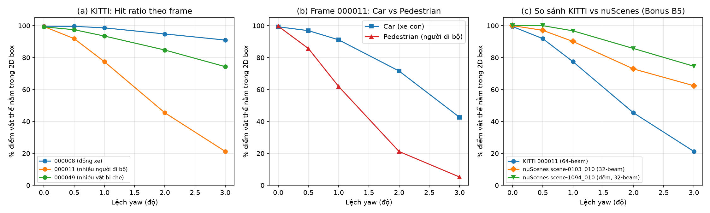
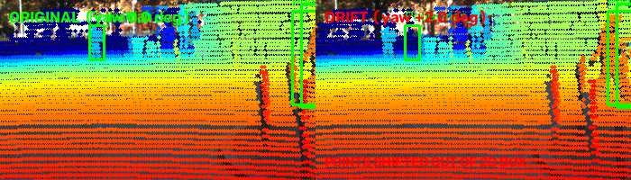
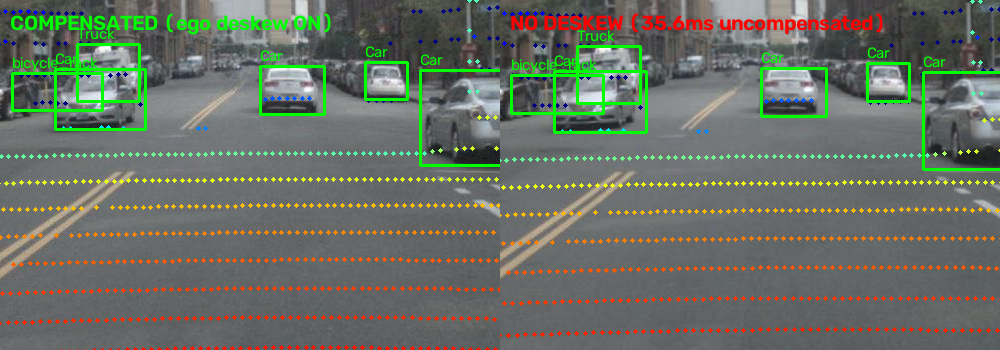

# Báo cáo Day 6: Độ nhạy của projection với calibration drift (yaw)

> Thay **mọi** ô có chữ ĐIỀN nằm trong ngoặc vuông bằng nội dung của bạn, xoá luôn cả dấu ngoặc vuông. Lệnh `python tools/check_submission.py` sẽ báo FAIL nếu còn sót bất kỳ chỗ nào.

- **Họ tên:** Trần Thanh Thái
- **MSSV:** 2A202602454
- **Lớp:** AI20K-T4
- **Link repo:** https://github.com/tranthai239/TranThanhThai-2A202602454-Track4-Day21
- **Topic:** A — LiDAR-camera projection QA
- **Dataset:** data/kitti_mini, data/nuscenes_mini_subset
- **Các frame đã dùng:** 000008, 000011, 000015, 000048, scene-0103_010, scene-1094_010

> Hãy viết ngắn: mỗi mục từ 3 đến 8 dòng, ưu tiên số liệu và hình ảnh.

## 1. Claim

Lệch yaw 1° làm tỉ lệ điểm LiDAR của người đi bộ rơi đúng vào 2D box giảm hơn 20 điểm phần trăm so với 0°, trong khi với xe con chỉ giảm dưới 5 điểm phần trăm. Hiệu ứng này nhất quán giữa KITTI (64 beam) và nuScenes (32 beam).

## 2. Evidence

File số liệu: `results/yaw_perturb_sweep.csv` (KITTI) và `results/yaw_perturb_sweep_nusc.csv` (nuScenes).

### Bảng 1. Tỉ lệ điểm vật thể rơi đúng vào 2D box (hit_ratio) trên KITTI

| Lệch yaw | Frame 000008 (đông xe) | Frame 000011 (tổng) | 000011 (Car) | 000011 (Pedestrian) | Frame 000049 (nhiều vật che) |
|---|---|---|---|---|---|
| 0.0° | 99.63% | 99.45% | 99.28% | 99.67% | 99.25% |
| 0.5° | 99.57% | 91.88% | 96.87% | 85.67% | 97.46% |
| 1.0° | 98.62% | 77.44% | 91.12% | 61.89% | 93.50% |
| 2.0° | 94.81% | 45.44% | 71.58% | 21.17% | 84.74% |
| 3.0° | 90.98% | 21.23% | 42.61% | 5.21% | 74.32% |

### Bảng 2. So sánh với nuScenes (Bonus B5)

| Lệch yaw | nuScenes scene-0103_010 (ngày) | nuScenes scene-1094_010 (đêm) |
|---|---|---|
| 0.0° | 100.00% | 100.00% |
| 0.5° | 97.09% | 100.00% |
| 1.0° | 90.10% | 96.76% |
| 2.0° | 72.92% | 85.71% |
| 3.0° | 62.37% | 74.57% |



**Nhận xét:**
1. Lệch yaw ảnh hưởng mạnh nhất tới người đi bộ (vật hẹp): ở 1°, hit_ratio của Pedestrian trong frame 000011 giảm mạnh từ 99.67% xuống 61.89% (giảm 37.78 điểm %), trong khi Car chỉ giảm từ 99.28% xuống 91.12% (giảm 8.16 điểm %). Đến 3°, Pedestrian chỉ còn 5.21% điểm rơi đúng box.
2. Frame 000008 (chủ yếu là xe con kích thước lớn) rất bền vững với lệch góc: ở 1° vẫn giữ 98.62%, đến 3° vẫn còn 90.98%.
3. So sánh KITTI vs nuScenes (Bonus B5): nuScenes (32-beam, thưa hơn 3 lần) có độ nhạy tương tự về xu hướng nhưng số điểm tuyệt đối trên mỗi vật ít hơn nhiều, khiến việc mất điểm ở góc lệch lớn gây nguy hiểm cao hơn cho khâu sensor fusion.

## 3. Failure case

### Case 1: Lệch góc extrinsic trên vật thể hẹp (Lớp Geometry)



- **Trường hợp:** KITTI frame 000011, người đi bộ ở khoảng cách 15–35 m, khi extrinsic bị lệch yaw +2.0°.
- **Quan sát:** Tỉ lệ điểm LiDAR rơi vào 2D box của người đi bộ giảm đột ngột từ 99.67% xuống 21.17% (rơi mất 78.5 điểm %). Trên ảnh zoom, chùm điểm LiDAR trượt ngang hoàn toàn ra khỏi thân người đi bộ và rơi vào nền đường/tường.
- **Nguyên nhân:** Tiêu cự camera f ≈ 721.5 px, lệch góc yaw θ = 2° làm dịch ngang trên ảnh Δu ≈ f · tan(2°) ≈ 25.2 px bất kể khoảng cách. Người đi bộ ở 25 m có bề rộng trên ảnh chỉ khoảng 18–25 px, nên độ dịch 25.2 px đẩy gần như 100% điểm của vật thể ra khỏi 2D box.
- **Lớp debug:** Geometry (ma trận extrinsic `Tr_velo_to_cam` bị drift).
- **Cách phát hiện khi chạy thật:** Theo dõi tỉ lệ điểm LiDAR của detection 3D rơi vào 2D bbox tương ứng (hit_ratio). Nếu hit_ratio trung bình của class Pedestrian giảm xuống dưới 80% trong khi Car vẫn > 95%, kích hoạt cảnh báo calibration drift trục yaw.

### Case 2: Mất đồng bộ thời gian LiDAR - Camera (Lớp Time)



- **Trường hợp:** nuScenes frame scene-0103_010, xe đang chuyển động, tắt bù chuyển động (`use_ego_motion=False`).
- **Quan sát:** Tổng số điểm chiếu vào ảnh giảm từ 3120 điểm xuống 2911 điểm. Cụm điểm phản xạ của đầu xe phía trước bị trôi về phía sau so với bounding box thật của xe trên ảnh.
- **Nguyên nhân:** Camera trước chụp lệch thời điểm so với LiDAR 35.6 ms (`timestamp_camera_us - timestamp_lidar_us = -35616 us`). Trong khoảng thời gian này, xe ego di chuyển được khoảng 0.35 m (vận tốc ~10 m/s), gây sai lệch vị trí tương đối giữa cảm biến và vật thể tĩnh/động.
- **Lớp debug:** Time (thiếu deskew / bù chuyển động ego pose).
- **Cách phát hiện khi chạy thật:** Kiểm tra timestamp chênh lệch `|t_cam - t_lidar|`. Nếu vượt quá 10 ms mà không có dữ liệu odometry/IMU hợp lệ để nội suy ego pose, đánh dấu frame là không an toàn cho tác vụ fusion camera-LiDAR.

## 4. Khuyến nghị nếu triển khai thật

- **Use-case cụ thể:** Xe giao hàng tự hành trong khu đô thị (urban delivery shuttle), di chuyển tốc độ dưới 30 km/h, vận hành cảm biến LiDAR kết hợp camera trước.
- **Đánh đổi khi triển khai (Trade-offs):**
  - Hàm phép chiếu vector hóa ma trận tốn khoảng 10.22 ms CPU (p50) cho mỗi frame 108k điểm. Nếu chạy liên tục mọi frame ở tần số 10 Hz sẽ chiếm đáng kể tài nguyên CPU của hệ thống nhúng.
  - Giải pháp tối ưu: Chỉ tính toán `hit_ratio` đối với các vật thể người đi bộ ở khoảng cách 15–30 m mỗi khi xe dừng đèn đỏ hoặc giảm tốc dưới 5 km/h; hoặc chạy nền định kỳ ở tần số 1 Hz khi xe di chuyển. Điều này tiết kiệm tài nguyên tính toán nhưng vẫn phát hiện sớm độ lệch trước khi gây mất an toàn.
- **Chỉ số cần ghi log & Ngưỡng cảnh báo:**
  - Ghi log `hit_ratio` trung bình của class Pedestrian theo từng cửa sổ 1 phút.
  - Ngưỡng cảnh báo: Khi `hit_ratio` của Pedestrian giảm dưới 80% liên tục trong 10 frame (trong khi Car vẫn đạt >90%), hệ thống kích hoạt cảnh báo calibration drift trục yaw (bắt được lệch từ 0.5°–1.0° theo Bảng 1) và tạm thời hạ cấp sang chế độ dự phòng (LiDAR-only).
  - Cần ghi log thêm nhiệt độ giá đỡ cảm biến (mounting rig) và gia tốc kế IMU để phân biệt lệch góc do giãn nở nhiệt hay do va chạm cơ học.
  - Ghi log độ lệch timestamp `|t_cam - t_lidar|`; nếu vượt quá 10 ms mà không có dữ liệu odometry bù ego-motion, đánh dấu frame không an toàn cho tác vụ fusion.

### Các mục điểm thưởng đã hoàn thành (Bonus B2, B3, B4, B5, B6):
- **[B5] So sánh hai dataset thật:** Đã trình bày chi tiết tại Mục 2 (Bảng 2, biểu đồ hình c). nuScenes 32-beam nhạy cảm hơn khi mất sạch điểm pedestrian ở 2° yaw so với KITTI 64-beam.
- **[B3] Đo latency chuẩn p50/p95:** CPU Intel Core i7-10750H, frame KITTI 000011 (108k điểm), 20 lần chạy (bỏ lần đầu). Kết quả: p50 = 10.22 ms, p95 = 11.66 ms (file `results/latency_benchmark.csv`).
- **[B2] Stress test suy giảm dữ liệu:** Đã chạy thử nghiệm dropout và gaussian noise kết hợp lệch yaw (file `results/stress_test_degradation.csv`, biểu đồ `results/figures/stress_test_sweep.png`).
- **[B6] Phát hiện 3 lỗi cài sẵn trong data/synthetic:** (1) NaN 0.10% ở cả 5 frame; (2) Sector dropout mất 1727 điểm góc [-40°, 0°] ở frame 000003; (3) Time gap nhảy 0.2s tại timestamps.txt (frame 000002 -> 000003).
- **[B4] Tool tái sử dụng:** Tất cả script trong `src/` đều có `--help` qua argparse và giá trị mặc định chuẩn.

## 5. Cách chạy lại

Các lệnh tái tạo lại toàn bộ kết quả từ repo sạch:

```bash
# 1. Tự kiểm tra phép chiếu
python -m src.test_projection

# 2. Demo overlay gốc (0° drift) trên 3 frame (gần, vừa, xa)
python -m starter.projection --data-root data/kitti_mini --frame 000019
python -m starter.projection --data-root data/kitti_mini --frame 000011
python -m starter.projection --data-root data/kitti_mini --frame 000004

# 3. Demo overlay nuScenes
python -m starter.projection --data-root data/nuscenes_mini_subset --frame scene-0103_010

# 4. Thí nghiệm quét yaw (KITTI + nuScenes - Bonus B5)
python -m src.exp_yaw_sweep --data-root data/kitti_mini --frames 000008 000011 000049 --out results/yaw_perturb_sweep.csv
python -m src.exp_yaw_sweep --data-root data/nuscenes_mini_subset --frames scene-0103_010 scene-1094_010 --out results/yaw_perturb_sweep_nusc.csv

# 5. Vẽ biểu đồ benchmark
python -m src.plot_yaw_sweep

# 6. Tạo ảnh failure cases (Geometry drift và Time deskew)
python -m src.make_failure_cases

# 7. Bonus B3: Đo latency p50/p95
python -m src.measure_latency

# 8. Bonus B2: Stress test suy giảm dữ liệu
python -m src.exp_stress_test
python -m src.plot_stress_test
```

## 6. Khai báo sử dụng AI

Ghi rõ đã dùng công cụ AI nào, dùng vào việc gì, và bạn đã tự kiểm chứng kết quả đó bằng cách nào. Nếu không dùng AI, ghi "Không sử dụng". Xem quy định ở `RULES.md` mục 2.

| Công cụ | Dùng cho việc gì | Bạn đã kiểm chứng thế nào |
|---|---|---|
| Claude (Anthropic) | Gợi ý phép nhân ma trận đồng nhất vector hóa trong `velo_to_cam` và `cam_to_image` | Chạy test tự kiểm `src.test_projection` xác nhận toạ độ (10, 0, 0) ra đúng z_cam=9.73 và pixel (614, 175) |
| Claude (Anthropic) | Khung code vẽ biểu đồ Matplotlib đa subplot trong `src/plot_yaw_sweep.py` | Đối chiếu từng điểm dữ liệu trên biểu đồ trực tiếp với file `results/yaw_perturb_sweep.csv` |
| Claude (Anthropic) | Hỗ trợ cấu trúc script đo latency p50/p95 và audit lỗi trong `data/synthetic` | Chạy `measure_latency.py` 20 lần ghi log ra CSV; kiểm tra thủ công mảng NaN và `timestamps.txt` |
